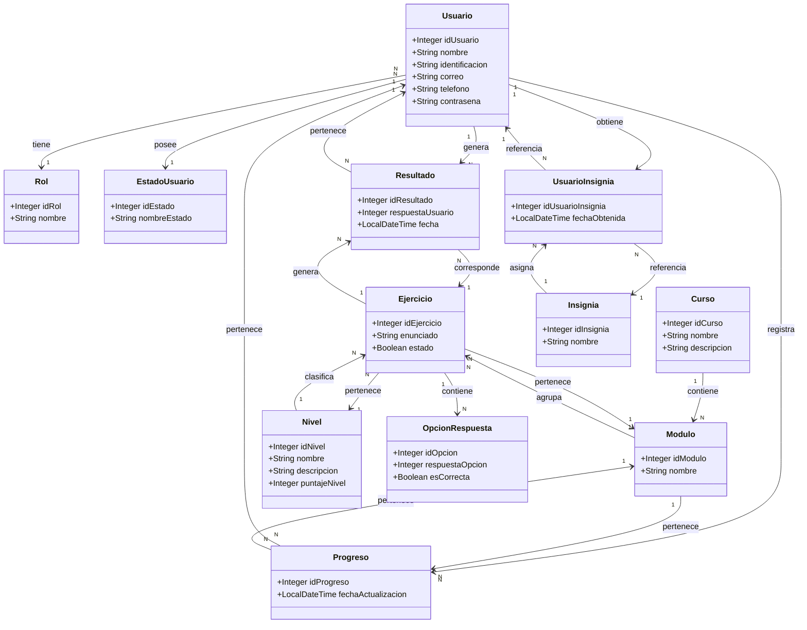

# E12 - DIAGRAMA DE CLASES

## Plataforma Educativa Web - Aprendiendo a Dividir

---

# Relación con el Proyecto

Este diagrama representa las entidades implementadas en:

* Spring Boot
* SQL Server
* JPA Repository
* Thymeleaf

y mantiene coherencia con:

* MER del proyecto
* CRUD visual de Usuario
* CRUD visual de Resultado
* Login por roles
* Gestión de módulos y ejercicios

---

# Tecnologías Relacionadas

* Java
* Spring Boot
* SQL Server
* Thymeleaf
* JPA
* MVC
