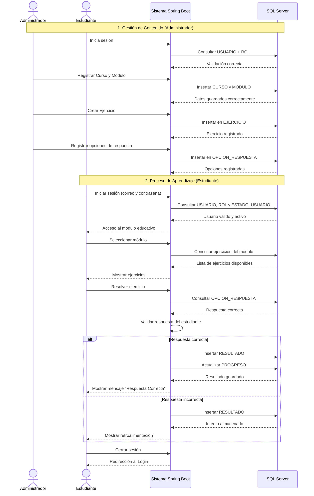

# E13 - DIAGRAMA DE SECUENCIA

## Plataforma Educativa Web - Aprendiendo a Dividir

---

# Relación con el Proyecto

Este diagrama representa el flujo real implementado en:

* LoginController
* UsuarioVistaController
* ResultadoVistaController
* ModuloVistaController

---

# Tablas Relacionadas

* USUARIO
* ROL
* ESTADO_USUARIO
* CURSO
* MODULO
* EJERCICIO
* OPCION_RESPUESTA
* RESULTADO
* PROGRESO

---

# Tecnologías Relacionadas

* Spring Boot
* SQL Server
* Thymeleaf
* HTML/CSS
* JPA Repository
* MVC

